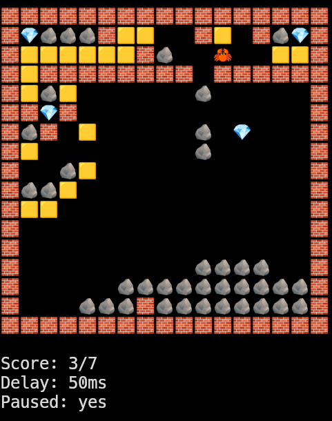
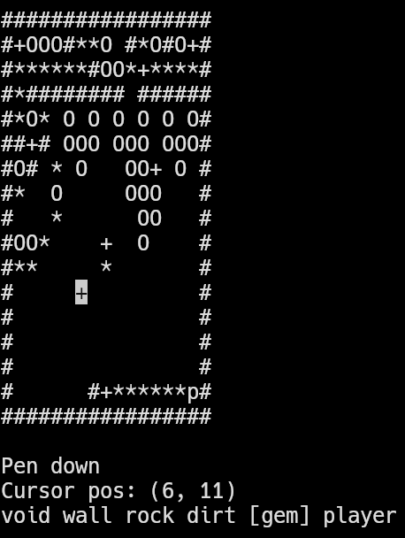

```sh
cargo r -- -h
```
```
FLAGS:
    -h, --help
        Show this message.
    -p, --pause
        Launch paused.
OPTIONS:
    -l, --level <string>
        Required.
        Specify a level to run.
        Can be used multiple times.
    -m, --mode <string>
        * gui
        * tui (default)
        * cli
        Select the interaction mode.
    -r, --run <string>
        * g / b / game (default)
        * e / editor
        Select the program mode.
    -s, --size <integer>
        Object size for GUI. (default 30 pixels).
    -d, --delay <integer>
        Delay between frames. (default: 1000 ms)\
```

```sh
cargo r -- -l assets/levels/level -m tui
```


```sh
cargo r -- -l assets/levels/level -m cli -r e
```


```sh
cargo r -- -l assets/levels/level -m gui -r e
```

