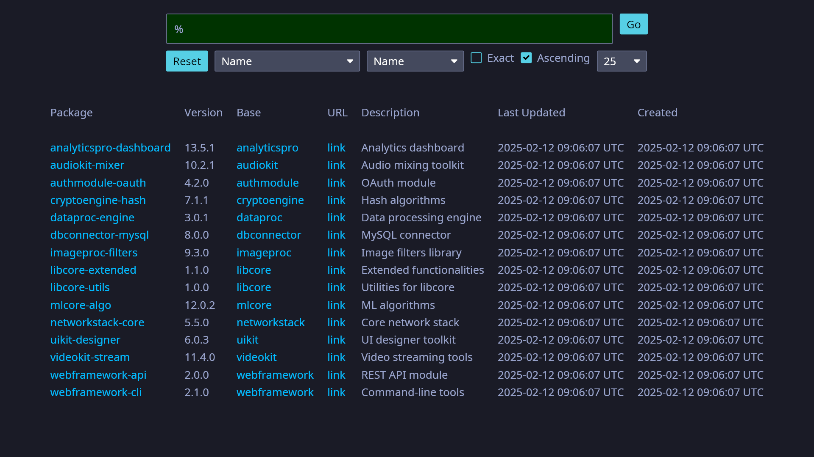

# Information System "Package Repository"

## Setup

```bash
# Setup the database
docker compose up -d

# Get environment variables (optional)
source .envrc

# Compile and execute
cargo run
```

## Usage

A user `test` with the password `testtest` is available (or you can register your own).

To search all packages enter a `%` in the search bar. Try searching `lib` for example.

When no input field is focused, the app supports UI scaling with `Ctrl-` and `Ctrl+`.

## Cleanup

```bash
docker compose down -v
cargo clean
```

## Showcase

### Login page


### Register page


### Search page


## Stuff that helped

* Architecture:
    - [How to apply hexagonal architecture to Rust](https://www.barrage.net/blog/technology/how-to-apply-hexagonal-architecture-to-rust)
    - [Implementing onion architecture using Rust](https://mathias-vandaele.dev/implementing-onion-architecture-using-rust)
* Design:
    - [Rust Data Modelling Without Classes](https://www.youtube.com/watch?v=z-0-bbc80JM)
    - ["Making Impossible States Impossible" by Richard Feldman](https://www.youtube.com/watch?v=IcgmSRJHu_8)
    - [Pretty State Machine Patterns in Rust](https://hoverbear.org/blog/rust-state-machine-pattern/)
* How to Iced:
    - [Building a simple text editor with iced, a cross-platform GUI library for Rust](https://www.youtube.com/watch?v=gcBJ7cPSALo)
    - [Unofficial Iced Guide](https://jl710.github.io/iced-guide/)
    - [icebreaker](https://github.com/hecrj/icebreaker)
    - [Halloy](https://github.com/squidowl/halloy)

---

> _The purpose of abstraction is not to be vague, but to create a new semantic level in which one can be absolutely precise._

— _Edsger W. Dijkstra_
