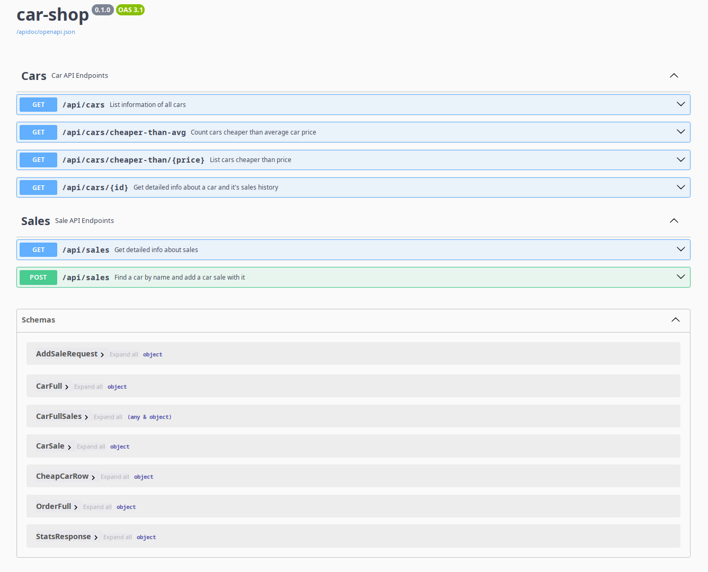
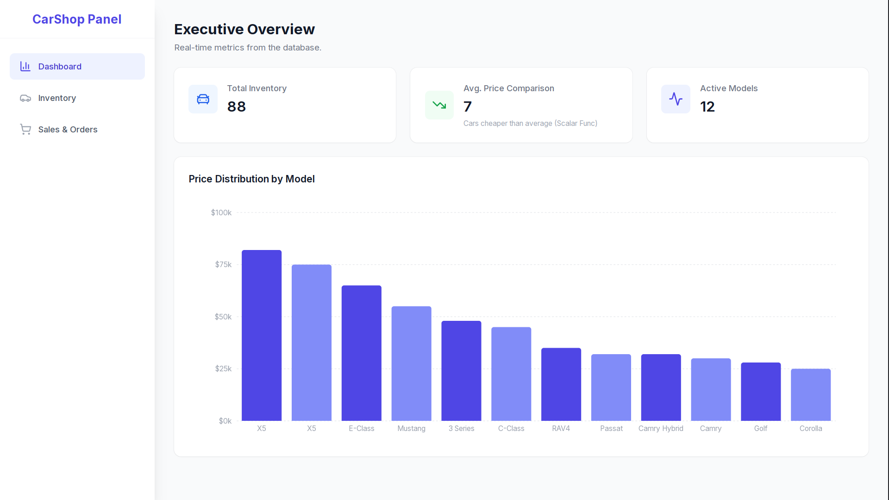
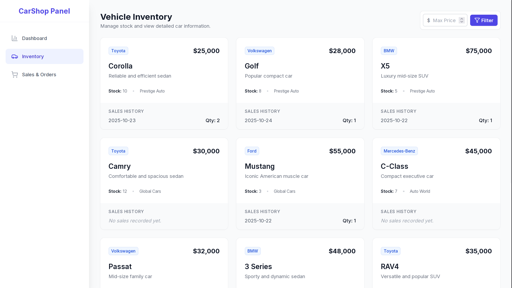
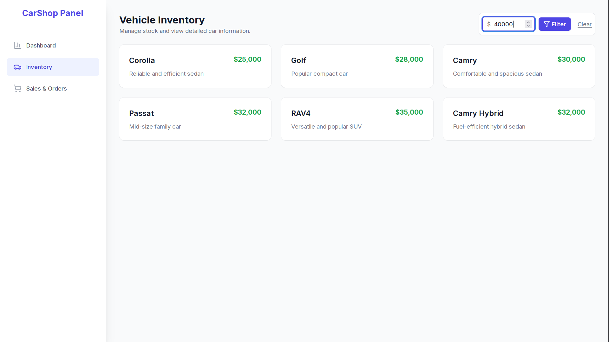
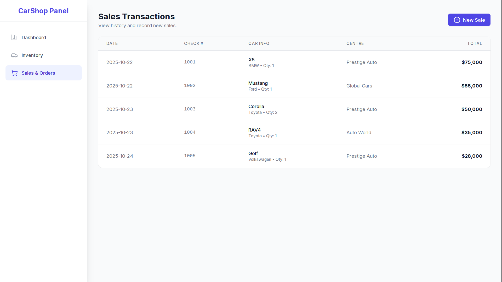
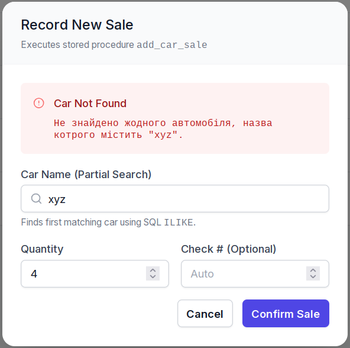

# Car Shop

Laboratory work number 3, which includes:
- A PostgreSQL database with functions and procedures.
- A Rust back-end that uses sqlx for the database, Axum for the web and Utoipa for OpenApi spec.
- A Front-end for better UX than Swagger UI, which I'll never tell you where I got it from.

## To start the project from this directory

```bash
# Init the database
docker run --name srbd3 \
        -e POSTGRES_PASSWORD=password \
        -e PGDATA=/var/lib/postgresql/pgdata \
        -p 5432:5432 -d postgres
sleep 3; # wait a bit if running commands in a batch
docker exec srbd3 psql -U postgres -c "CREATE DATABASE car_shop;"
docker cp sql/init.sql srbd3:/var/lib/postgresql/pgdata/
docker exec srbd3 psql -U postgres -d car_shop -f /var/lib/postgresql/pgdata/init.sql

# Get environment variables (optional)
source .envrc

# Compile and execute the backend
cargo run

# Bootstrap and start the website
cd frontend
npm install
npm run dev
```

- Website is at <http://localhost:3002>
- Swagger is at <http://localhost:3000/swagger-ui>
- OpenAPI spec is at <http://localhost:3000/apidoc/openapi.json>

## Showcase

### Swagger UI


### Website Dashboard


### Inventory



## Sales


